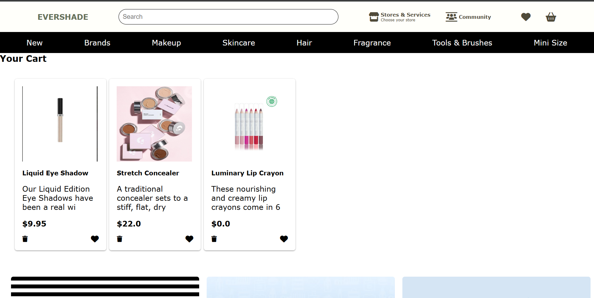

# EverShade - Revolutionizing Beauty with Sustainability and Inclusivity

EverShade is a digital platform revolutionizing the beauty industry by combining sustainability and inclusivity. It aims to provide a personalized and eco-conscious shopping experience while celebrating the diverse beauty of every individual. 

This project integrates Firebase for user authentication, cart and wishlist management, and personalized user experiences using CDN links.

## Features

- **User Authentication**
  - Login and Signup functionality using Firebase Authentication.
  - Uses Firebase `uid` for user identification instead of emails.

- **Personalized Shopping Experience**
  - Users can create and manage their cart and wishlist with Firebase Firestore.
  - Personalized recommendations based on user preferences.

## Technologies Used

- **Frontend**
  - HTML 
  - CSS 

- **Backend**
  - JavaScript 
  - Firebase 

## Screenshots

Here are some screenshots of the EverShade platform in action:

   

   

   

   

   